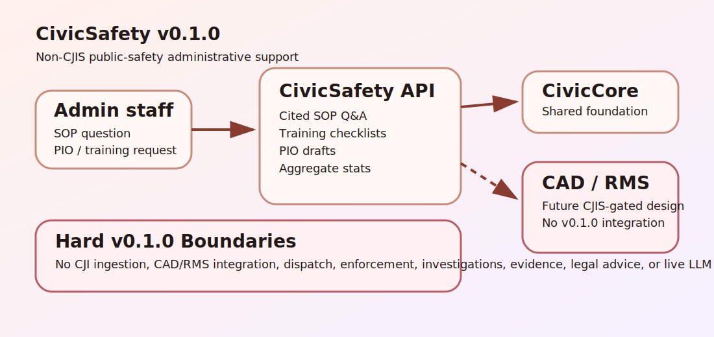

# CivicSafety User Manual

## Non-Technical Staff

CivicSafety helps public-safety administrative staff prepare cited non-CJIS policy/SOP answers, build training checklists, draft PIO updates, and summarize aggregate public statistics.

Supervisors and PIO staff remain responsible for every answer, checklist, statistic, and public draft. CivicSafety does not ingest CJI, connect to CAD/RMS, support dispatch, investigate cases, drive enforcement, manage evidence, provide legal advice, or replace public-safety systems of record.

## IT / Technical

Install with:

```bash
python -m pip install -e ".[dev]"
python -m uvicorn civicsafety.main:app --host 127.0.0.1 --port 8143
```

Runtime dependency: `civiccore==0.3.0`.

Primary endpoints:

- `GET /health` - service and CivicCore version.
- `GET /civicsafety` - public sample UI.
- `POST /api/v1/civicsafety/policy-answer` - cited non-CJIS policy/SOP answer draft.
- `POST /api/v1/civicsafety/training-checklist` - supervisor-reviewed training checklist.
- `POST /api/v1/civicsafety/pio-draft` - PIO-reviewed public update draft.
- `POST /api/v1/civicsafety/public-stats` - aggregate public-statistics summary.

## Architecture



CivicSafety is a module on top of CivicCore. v0.1.1 is deterministic and local: no CJI ingestion, CAD/RMS integration, dispatch, enforcement, investigations, evidence workflows, legal advice, live LLM calls, or connector runtime is shipped.
